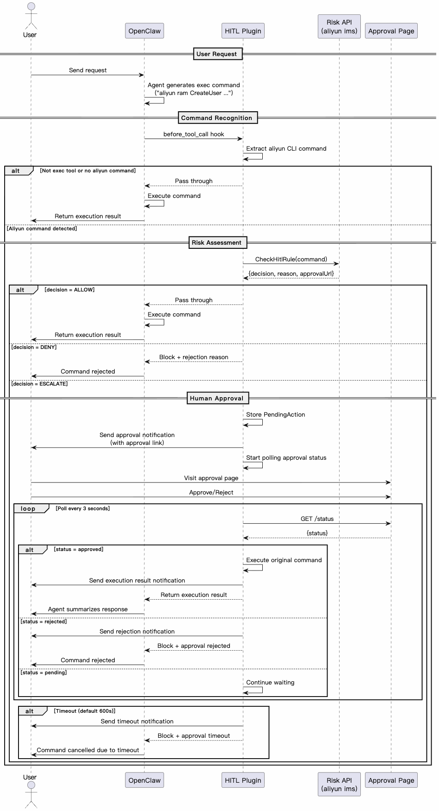

# Alibaba Cloud Agent HITL (Preview)

[中文文档](./README.zh-CN.md)

An [OpenClaw](https://github.com/nicepkg/openclaw) plugin that performs risk detection when executing Alibaba Cloud CLI commands, triggering Human-in-the-Loop (HITL) mechanism when necessary to reduce operational risks.

> **Note:**
>
> Large language models have strong autonomy, and there is still some uncertainty during Agent execution. Please strictly control Agent permissions;
>
> This plugin is in preview and may not cover all risky operations. Please thoroughly test to ensure it meets your needs.

## Table of Contents

- [Prerequisites](#prerequisites)
- [Quick Start](#quick-start)
- [Features](#features)
- [Configuration](#configuration)
- [Security](#security)
- [License](#license)

## Prerequisites

- OpenClaw >= 2026.3.24
- Node.js >= 22.0.0
- Alibaba Cloud CLI (`aliyun`) installed and configured
- When using external channels, run: `openclaw config set session.dmScope per-channel-peer`
- **Custom API configurations are not supported** 

## Quick Start

```bash
openclaw plugins install @alicloud/alibabacloud-hitl-claw-plugin
```

## Features

- **CLI Command Recognition**: Recognizes `aliyun` CLI commands executed by the Agent
- **Risk Assessment**: Integrates with Alibaba Cloud IMS `CheckHitlRule` API for risk detection
- **Human Approval**: High and medium-risk commands require human approval via a secure link
- **Multi-Channel Support**: Works with DingTalk, Feishu, and OpenClaw console interfaces

### Command Recognition

#### Trigger Conditions

| Condition | Description |
|-----------|-------------|
| Tool Type | Only checks `exec` tool calls for Alibaba Cloud CLI: `aliyun` |
| Command Pattern | Matches `aliyun <ProductCode> <APIName> [Parameters...]` |
| Supported Styles | Both RPC and ROA styles |

#### Parsing Method

Uses [shell-quote](https://www.npmjs.com/package/shell-quote) library for professional shell command parsing, supporting:

- Pipe operator `|`
- Logical operators `&&`, `||`
- Command separator `;`
- Background execution `&`
- Quotes and escape characters

#### Examples

| Original Command | Server Check | Command Sent to Server | Notes |
|------------------|--------------|------------------------|-------|
| `aliyun ecs DescribeInstances` | ✅ Yes | `aliyun ecs DescribeInstances` | Standard RPC style |
| `aliyun ram CreateUser --UserName test` | ✅ Yes | `aliyun ram CreateUser --UserName test` | Write operation with params |
| `aliyun cs GET /clusters` | ✅ Yes | `aliyun cs GET /clusters` | ROA style |
| `ls && aliyun ecs DeleteInstance --InstanceId i-xxx` | ✅ Yes | `aliyun ecs DeleteInstance --InstanceId i-xxx` | Extracts Alibaba Cloud part from composite command |
| `aliyun configure` | ❌ No | - | Missing API name, no check triggered |
| `aws ec2 describe-instances` | ❌ No | - | Not an Alibaba Cloud command |

### Risk Decisions

Risk API (`aliyun ims CheckHitlRule`) returns three decisions:

| Decision | Meaning | Plugin Behavior |
|----------|---------|-----------------|
| `ALLOW` | Low risk, allow execution | Pass through |
| `ESCALATE` | High risk, requires approval | Suspend and wait for approval |

### How It Works



## Configuration

The plugin reads configuration from `config.json`:

```json
{
  "enabled": true,
  "confirmationTimeoutSeconds": 600
}
```

| Option | Type | Default | Description |
|--------|------|---------|-------------|
| `enabled` | boolean | `true` | Whether to enable the plugin |
| `confirmationTimeoutSeconds` | number | `600` | Approval timeout in seconds |

## Security

### 1. Shell Command Execution

This plugin invokes the **Alibaba Cloud CLI** for:

| Scenario | Description |
|----------|-------------|
| Sensitive Operation Detection | Calls `aliyun ims CheckHitlRule` to detect if the current command is a sensitive operation |
| Resume User CLI Request | After user approval, resumes execution of the original command |

This plugin runs in Node.js and uses the `child_process` module to invoke the aliyun CLI.

**Data sent to server**: aliyun CLI command content, CLI version, plugin version, Agent type, Session ID

### 2. Network Requests

This plugin uses `fetch` to poll approval status and sends approval result notifications to external channels (DingTalk, Feishu) via OpenClaw's `dispatchReplyFromConfig` API.

- No sensitive credentials are sent to the server
- Network requests are only for approval status polling and message notifications


**All above behaviors are essential for core plugin functionality. Sensitive information is processed locally and will not be sent to the server.**

## License

MIT
