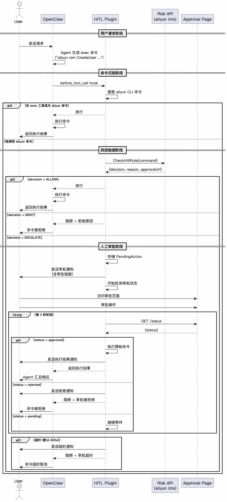

# 阿里云 Agent HITL (预览版)

[English](./README.md)

一款 [OpenClaw](https://github.com/nicepkg/openclaw) 插件，在执行阿里云 CLI 命令时进行风险检测，必要时触发人机协同机制(HITL - Human in the Loop)，降低操作风险。

> **特别说明：**
>
> 大模型有很强的自主性，在 Agent 执行中仍有一些不确定性，请务必严格控制 Agent 的权限；
>
> 本插件处于预览版，可能无法覆盖所有风险操作，请务必充分试用以确认满足使用需要。

## 目录

- [前置要求](#前置要求)
- [快速开始](#快速开始)
- [功能特性](#功能特性)
- [配置说明](#配置说明)
- [安全说明](#安全说明)
- [许可证](#许可证)

## 前置要求

- OpenClaw >= 2026.3.24
- Node.js >= 22.0.0
- 已安装并配置阿里云 CLI (`aliyun`)
- 使用外部渠道时，需要设置：`openclaw config set session.dmScope per-channel-peer`
- **不支持自定义 API**

## 快速开始

```bash
openclaw plugins install @alicloud/alibabacloud-hitl-claw-plugin
```

## 功能特性

- **CLI 命令识别**：识别 Agent 执行的 `aliyun` CLI 命令
- **风险评估**：集成阿里云 IMS `CheckHitlRule` API 进行风险检测
- **人工审批**：高、中风险命令需要通过安全链接进行人工审批
- **多渠道支持**：支持钉钉、飞书及 OpenClaw 控制台界面

### 命令识别范围

#### 触发条件

| 条件 | 说明 |
|------|------|
| 工具类型 | 仅检测 `exec` 命令下阿里云 CLI: `aliyun` 调用 |
| 命令模式 | 匹配 `aliyun <产品代码> <API名称> [参数...]` |
| 支持风格 | RPC 风格和 ROA 风格均支持 |

#### 解析方式

使用 [shell-quote](https://www.npmjs.com/package/shell-quote) 库进行专业的 shell 命令解析，支持：

- 管道操作符 `|`
- 逻辑运算符 `&&`、`||`
- 命令分隔符 `;`
- 后台执行 `&`
- 引号和转义字符

#### 示例

| 原始命令 | 服务端检测 | 发送至服务端的命令 | 说明 |
|----------|------------|-------------------|------|
| `aliyun ecs DescribeInstances` | ✅ 是 | `aliyun ecs DescribeInstances` | 标准 RPC 风格 |
| `aliyun ram CreateUser --UserName test` | ✅ 是 | `aliyun ram CreateUser --UserName test` | 带参数的写操作 |
| `aliyun cs GET /clusters` | ✅ 是 | `aliyun cs GET /clusters` | ROA 风格 |
| `ls && aliyun ecs DeleteInstance --InstanceId i-xxx` | ✅ 是 | `aliyun ecs DeleteInstance --InstanceId i-xxx` | 从复合命令中提取阿里云部分 |
| `aliyun configure` | ❌ 否 | - | 缺少 API 名称，不触发检测 |
| `aws ec2 describe-instances` | ❌ 否 | - | 非阿里云命令 |

### 风控决策

风控 API (`aliyun ims CheckHitlRule`) 返回三种决策：

| 决策 | 含义 | 插件行为 |
|------|------|----------|
| `ALLOW` | 低风险，允许执行 | 直接放行 |
| `ESCALATE` | 高风险，需人工审批 | 挂起等待审批 |

### 工作原理



## 配置说明

插件从 `config.json` 读取配置：

```json
{
  "enabled": true,
  "confirmationTimeoutSeconds": 600
}
```

| 配置项 | 类型 | 默认值 | 说明 |
|--------|------|--------|------|
| `enabled` | boolean | `true` | 是否启用插件 |
| `confirmationTimeoutSeconds` | number | `600` | 审批超时时间（秒） |

## 安全说明

### 1. Shell 命令执行

本插件会调用 **阿里云 CLI** 用于：

| 场景 | 说明 |
|------|------|
| 敏感操作检测 | 调用 `aliyun ims CheckHitlRule` 检测当前命令是否为敏感操作 |
| 恢复执行用户的 CLI 请求 | 用户审批通过后，恢复执行原始命令 |

本插件运行在 Node.js 环境中，调用 aliyun CLI 程序需通过 `child_process` 模块实现。

**发送至服务端的数据**：aliyun CLI 命令内容、CLI 版本、插件版本、Agent 类型、Session ID

### 2. 网络请求

本插件使用 `fetch` 轮询审批状态，并通过 OpenClaw 的 `dispatchReplyFromConfig` API 向外部渠道（钉钉、飞书）发送审批结果通知。

- 不会将任何敏感凭证发送至服务端
- 网络请求仅用于审批状态轮询和消息通知


**以上行为均为插件核心功能所必需，涉及的敏感信息均在本地处理，不会发送至服务端。**

## 许可证

MIT
